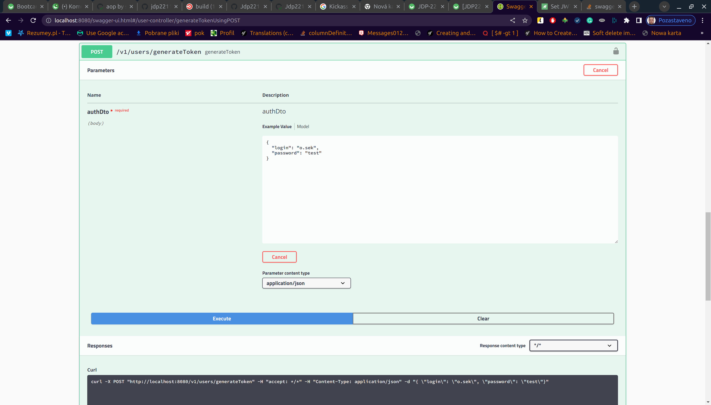
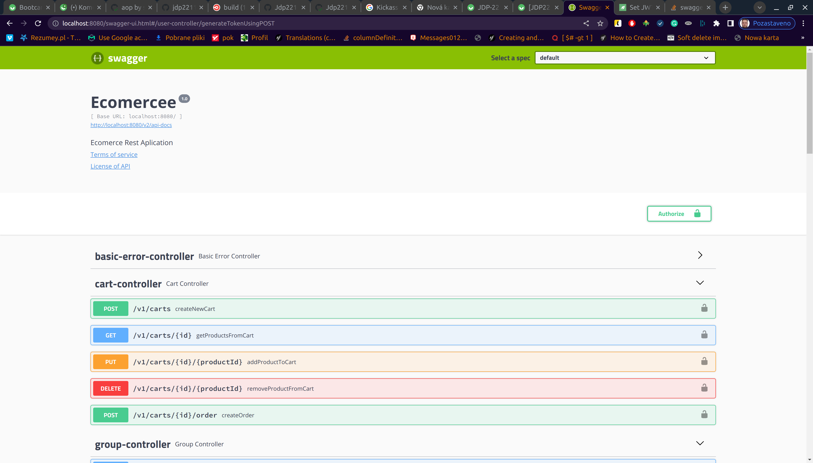

## Ecommercee Application ##
1. Ecommercee is a ***REST*** online store project, which is using ***MySQL*** as a database source, build with ***Spring Boot*** and ***Hibernate*** frameworks.
2. To compile project, we need JVM version **1.8** with SpringBoot framework version **2.1.18.RELEASE**
3. To build a project we have to use command ’ ./gradlew build ’
4. You can use api on this page http://localhost:8080/swagger-ui.html, postman or other application
5. When you want to modify data you need
    1. generate token 
    2. use Authorize button 
    3. You need type token with prefix "Bearer "
6. When you want to modify data you need to be careful in this version because for sub-entities sometimes you need to add a list of ids and sometimes a list of objects.